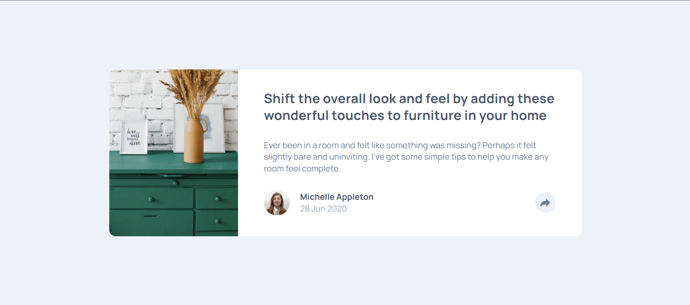

# Frontend Mentor - Article Preview Component Solution

This is my solution to the Article Preview Component challenge on Frontend Mentor.  
Frontend Mentor challenges help developers improve their frontend skills by building realistic UI components based on real-world designs.

---

## Table of contents

- Overview  
  - The challenge  
  - Screenshot  
  - Links  
- My process  
  - Built with  
  - What I learned
  - Time Estimation
  - Continued development  
  - Useful resources  
- Author  

---

## Overview

### The challenge

Users should be able to:

- View the optimal layout for the component depending on their device's screen size  
- Toggle social media share links by clicking the share icon  

The goal of this challenge is to recreate the design as closely as possible while maintaining clean, readable, and maintainable code.

---

### Screenshot

---

### Links

- Live Site URL: https://enghalih.github.io/article-preview-compenent/

---

## My process

### Built with

- Semantic HTML5  
- CSS Custom Properties  
- CSS Grid  
- Flexbox  
- SCSS varibel, map, and function
- Mobile-first workflow  
- Vanilla JavaScript  

---

### What I learned

Working on this project helped me strengthen my understanding of core frontend concepts, especially layout and styling fundamentals. I practiced choosing between CSS Grid and Flexbox based on layout needs, and learned how modern CSS utilities can simplify alignment and positioning.

I also improved my debugging skills by inspecting pseudo-elements in browser developer tools, understanding why they sometimes do not appear, and identifying common causes such as missing content, incorrect positioning, or stacking context issues.

Additionally, this project reinforced the importance of using valid CSS color formats and following best practices to avoid silent styling errors.

---

### Time Estimation for this project

time estimation: 4 hours
time spended: 3 hours 20 minutes

---

### Continued development

In future projects, I would like to:

- Improve accessibility and keyboard interaction handling  
- Explore more advanced UI animation techniques  
- Apply design tokens more consistently across components  
- Practice structuring CSS for better scalability and maintainability  

---

### Useful resources

- MDN Web Docs – CSS Grid Layout  
- MDN Web Docs – Pseudo-elements  
- Frontend Mentor community solutions  

---

## Author

- GitHub: https://github.com/enghalih
- Frontend Mentor: https://www.frontendmentor.io/profile/enghalih
